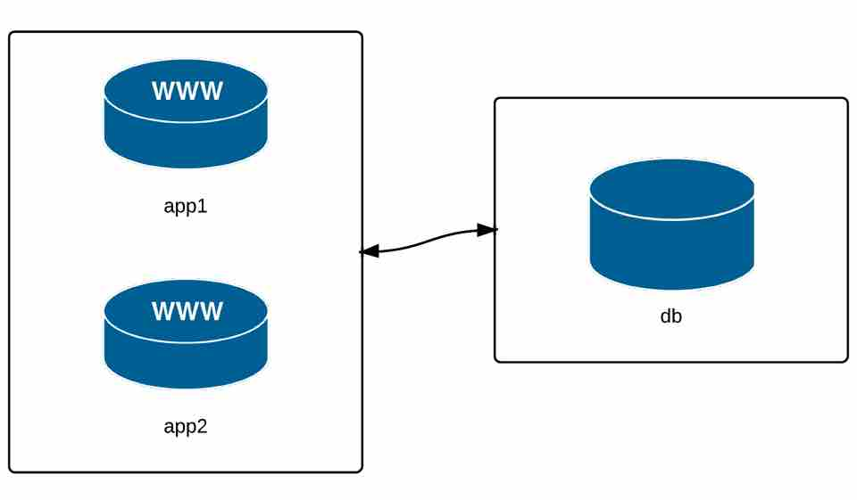

# Ad-hoc 命令的执行

发起和编排日常工作任务。

- 使用 yum apt 其它 管理软件包和补丁
- 查看资源利用率：磁盘空间、内存、CPU、swap 空间、网络
- 查看日志文件
- 管理系统用户和组
- 从服务器上上传、下载文件
- 部署应用或者维护运行的应用
- 重启服务器
- 管理 cron 工作

在排错的时候，还是会需要手工执行。在这些必要的时候，即使不使用 Ansbile 的高级功能，用它一对多的高效执行。

## 构建用于测试的基础设施



查看 Vagrant 文件

```ruby
# -*- mode: ruby -*-
# vi: set ft=ruby :

VAGRANTFILE_API_VERSION = "2"

Vagrant.configure(VAGRANTFILE_API_VERSION) do |config|

  # 通用配置信息
  config.vm.box = "geerlingguy/centos7"
  config.ssh.insert_key = false
  config.vm.synced_folder ".", "/vagrant", disabled: true
  config.vm.provider :virtualbox do |v|
    v.memory = 512
    v.linked_clone = true
  end

  # 应用服务器 1.
  config.vm.define "app1" do |app|
    app.vm.hostname = "orc-app1.test"
    app.vm.network :private_network, ip: "192.168.60.4"
  end

  # 应用服务器 2.
  config.vm.define "app2" do |app|
    app.vm.hostname = "orc-app2.test"
    app.vm.network :private_network, ip: "192.168.60.5"
  end

  # 数据库服务器
  config.vm.define "db" do |db|
    db.vm.hostname = "orc-db.test"
    db.vm.network :private_network, ip: "192.168.60.6"
  end
end
```

vagrant up


## 主机清单文件

-i hosts.ini 手工定义管理对象服务器，受管理服务器分组定义，设置执行参数。
ansible.cfg 当前目录或者系统默认安装目录下，指定 hosts.ini 文件的位置。


## 命令执行的机制

* 默认多线程并发执行，并发数量可调整

ansible multi -a "hostname"

ansible multi -a "hostname" -f 1


ansible 命令执行环境变量

* ansible.cfg
* export ANSIBLE_INVENTORY=hosts.ini
* ANSIBLE_HOST_KEY_CHECKING=False
* 在 X 主机上执行 Y 命令，或者执行 Y 命令到 X 主机上都可以，相同效果；ansible  -a "hostname" multi

多次执行上面的同一个命令，观察 host 顺序的变化。

多线程执行在服务器数量越多的时候，加速效果越明显，甚至 5~10 台服务器以上，就可以发现串行和并行执行速度的差异。在 -f 10  -f 20  -f 25，在大规模处理的过程中，处理速度的瓶颈可能是依赖于运行 ansible 这条命令的系统资源和网络连接（带宽和连接数）。

*  健康检查系统，使用远程执行Linux原生命令的方式

查看磁盘空间使用量

ansible multi -a "df -h"

查看内存使用量

ansible multi -a "free -m"

检查时钟是否同步

ansible multi -a "date"

查看系统详细配置信息

ansible multi -m setup 
ansible multi -m setup |grep ansible_kernel

* 使用 Ansible 模块实施变更

使用 yum 模块安装 chrony 软件包

ansible multi -b -m yum -a "name=chrony state=present"

* -b / --become 用 sudo 执行命令
* -K / --ask-become-pass 输入提权密码

使用 service 模块启动 chronyd 服务

ansible multi -b -m service -a "name=chronyd state=started enabled=yes"

执行时间同步命令，同步所有服务器的时钟

ansible multi -b -a "chronyc tracking"


## 配置服务器组或单个服务器

* 配置 django 应用服务器

ansible app -b -m yum -a "name=python3-pip state=present"
ansible app -b -m pip -a "name=django<4 state=present"
ansible app -a "python -m django --version"

方便性和易用性高于逐一执行手工 shell 命令。但是使用 playbook 的方式更佳。

* 配置数据库服务器

安装包和服务

ansible db -b -m yum -a "name=mariadb-server state=present"
ansible db -b -m service -a "name=mariadb state=started enabled=yes"

安装防火墙，并配置策略

ansible db -b -m yum -a "name=firewalld state=present"
ansible db -b -m service -a "name=firewalld state=started enabled=yes"
ansible db -b -m firewalld -a "zone=database state=present permanent=yes"
ansible db -b -m firewalld -a "source=192.168.60.0/24 zone=database state=enabled permanent=yes"
ansible db -b -m firewalld -a "port=3306/tcp zone=database state=enabled permanent=yes"

配置数据库访问用户名和密码，用 mysql_* 相关模块；替代执行 mysql_secure_installation 命令

ansible db -b -m yum -a "name=python3-PyMySQL state=present"
ansible db -b -m mysql_user -a "name=django host=% password=12345 priv=*.*:ALL state=present"

* 在服务器组中挑选个别服务器执行运维工作

检查应用服务器集群时间同步服务是否正常运行

ansible app -b -a "systemctl status chronyd"

重启 60.4 的 chronyd 服务

ansible app -b -a "service chronyd restart" --limit "192.168.60.4"

用简单的模式匹配，* 代表任何字符串
ansible app -b -a "service ntpd restart" --limit "*.4"

或者用 ~ 开始一个正则表达式
ansible app -b -a "service ntpd restart" --limit ~".*\.4"

以上这种情况属于临时的用法，如果符合某种特征的集合被经常用到，可以考虑将其加入主机清单文件中。

## 管理用户和组

user 和 group 模块让声明式的配置和操作系统无关。非常容易理解。

ansible app -b -m group -a "name=admin state=present"

* state=absent
* gid=[gid]
* system=yes

ansible app -b -m user -a "name=johndoe group=admin createhome=yes"


